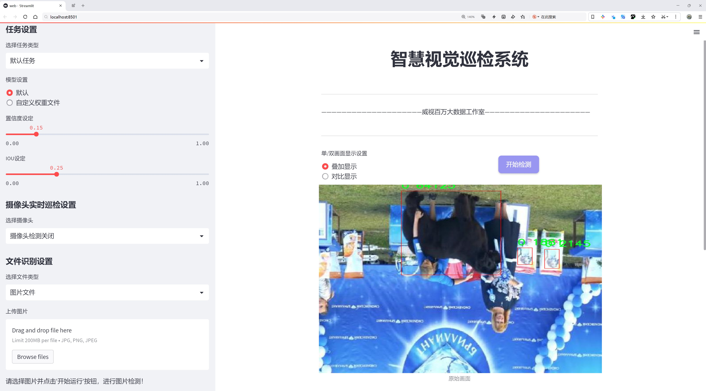
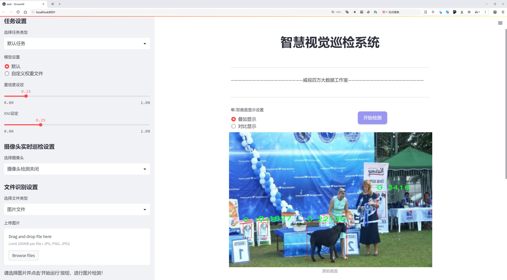
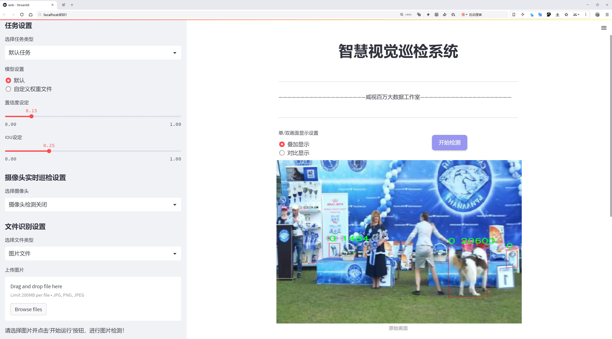
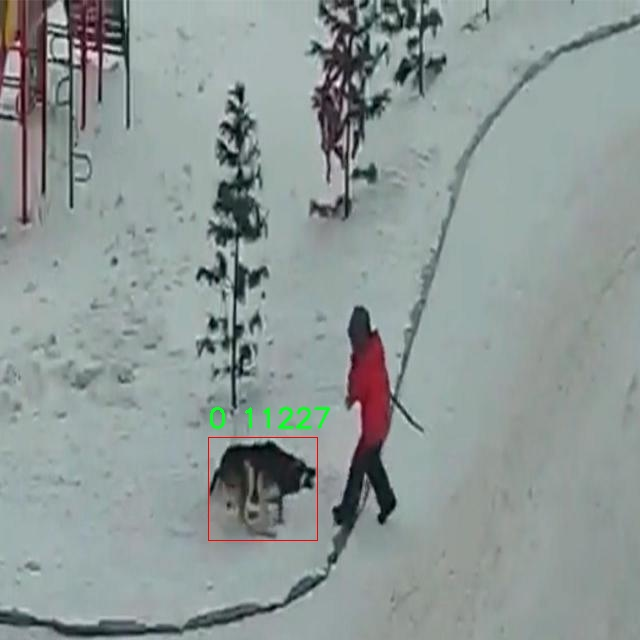
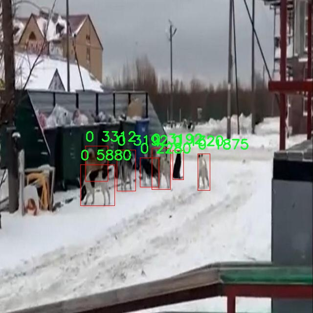
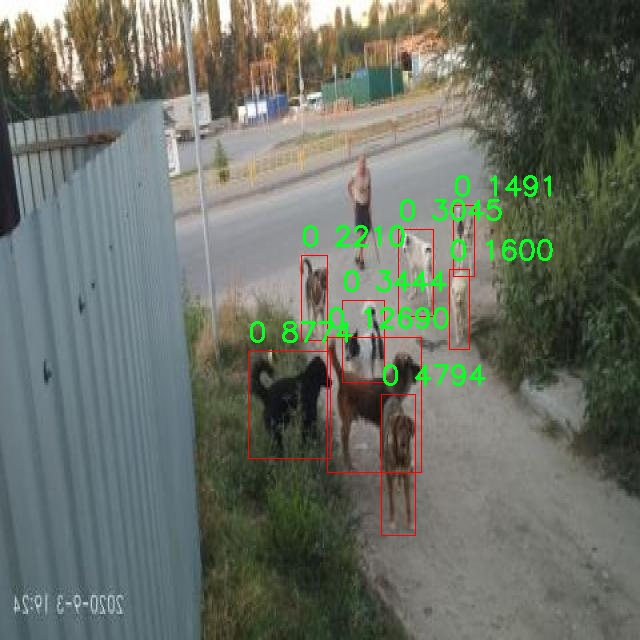
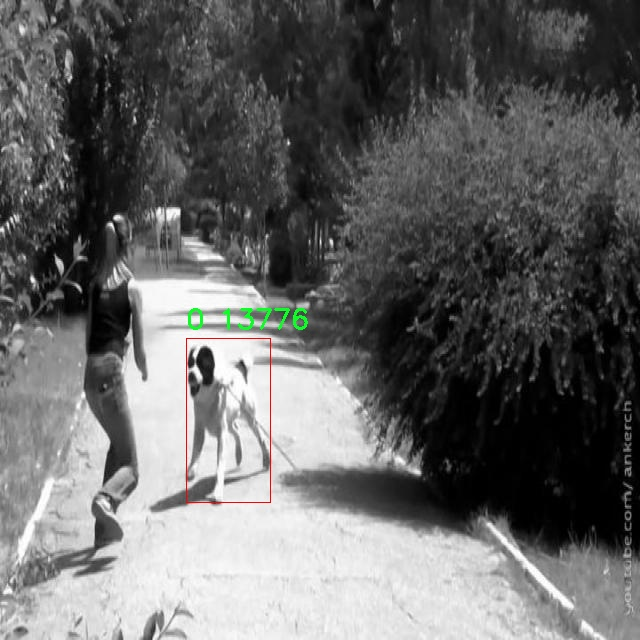
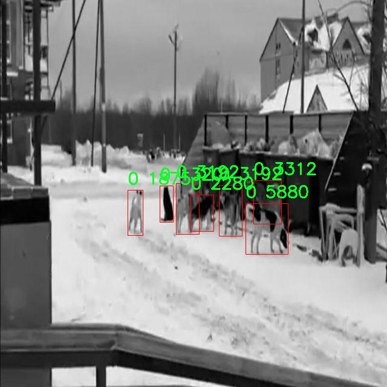

# 犬类检测检测系统源码分享
 # [一条龙教学YOLOV8标注好的数据集一键训练_70+全套改进创新点发刊_Web前端展示]

### 1.研究背景与意义

项目参考[AAAI Association for the Advancement of Artificial Intelligence](https://gitee.com/qunshansj/projects)

项目来源[AACV Association for the Advancement of Computer Vision](https://gitee.com/qunmasj/projects)

研究背景与意义

随着人工智能技术的迅猛发展，计算机视觉领域取得了显著的进步，尤其是在目标检测方面。目标检测技术的应用范围广泛，涵盖了安防监控、自动驾驶、智能家居等多个领域。犬类作为人类生活中不可或缺的伴侣动物，其检测与识别在宠物管理、动物保护、公共安全等方面具有重要的实际意义。传统的犬类检测方法多依赖于人工识别，不仅效率低下，而且容易受到环境因素的影响，导致识别准确率不高。因此，基于深度学习的目标检测技术逐渐成为研究的热点。

YOLO（You Only Look Once）系列模型因其高效的实时检测能力而受到广泛关注。YOLOv8作为该系列的最新版本，进一步提升了检测精度和速度，适用于多种复杂场景。然而，尽管YOLOv8在通用目标检测任务中表现优异，但在特定应用场景，如犬类检测中，仍然存在一定的局限性。针对这一问题，本文提出了一种基于改进YOLOv8的犬类检测系统，旨在通过优化模型结构和训练策略，提高犬类检测的准确性和鲁棒性。

本研究所使用的数据集包含2700张犬类图像，虽然数量相对较少，但涵盖了多种犬种和不同的拍摄环境，为模型的训练提供了基础。该数据集的单一类别（犬类）使得模型能够专注于犬类特征的学习，从而提高检测精度。此外，数据集的多样性有助于模型在不同场景下的泛化能力。通过对YOLOv8模型进行改进，结合数据增强、迁移学习等技术，能够有效提升模型在犬类检测任务中的表现。

犬类检测系统的研究不仅具有学术价值，也具有重要的社会意义。随着城市化进程的加快，流浪犬问题日益严重，相关部门亟需高效的技术手段进行犬类管理和保护。通过建立一个高效的犬类检测系统，可以为流浪犬的监测、救助和领养提供技术支持，促进人犬和谐共处。此外，该系统还可以应用于宠物行业，为宠物主人提供更智能的管理服务，提升宠物的生活质量。

综上所述，基于改进YOLOv8的犬类检测系统的研究，不仅推动了目标检测技术在特定领域的应用，也为犬类管理和保护提供了新的思路和方法。未来，随着数据集的不断丰富和模型的进一步优化，该系统有望在实际应用中发挥更大的作用，为社会的可持续发展贡献力量。

### 2.图片演示







##### 注意：由于此博客编辑较早，上面“2.图片演示”和“3.视频演示”展示的系统图片或者视频可能为老版本，新版本在老版本的基础上升级如下：（实际效果以升级的新版本为准）

  （1）适配了YOLOV8的“目标检测”模型和“实例分割”模型，通过加载相应的权重（.pt）文件即可自适应加载模型。

  （2）支持“图片识别”、“视频识别”、“摄像头实时识别”三种识别模式。

  （3）支持“图片识别”、“视频识别”、“摄像头实时识别”三种识别结果保存导出，解决手动导出（容易卡顿出现爆内存）存在的问题，识别完自动保存结果并导出到tempDir中。

  （4）支持Web前端系统中的标题、背景图等自定义修改，后面提供修改教程。

  另外本项目提供训练的数据集和训练教程,暂不提供权重文件（best.pt）,需要您按照教程进行训练后实现图片演示和Web前端界面演示的效果。

### 3.视频演示

[3.1 视频演示](https://www.bilibili.com/video/BV1dCtwebE4N/)

### 4.数据集信息展示

##### 4.1 本项目数据集详细数据（类别数＆类别名）

nc: 1
names: ['0']


##### 4.2 本项目数据集信息介绍

数据集信息展示

在本研究中，我们采用了名为“doggDetect”的数据集，以改进YOLOv8的犬类检测系统。该数据集专门针对犬类的检测任务进行设计，旨在为计算机视觉领域的研究人员和开发者提供一个高质量的训练基础。数据集的类别数量为1，具体类别列表中仅包含一个标识符“0”，这表明该数据集专注于单一的犬类检测任务。这种简化的类别结构不仅有助于提高模型的训练效率，还能使得检测系统在特定任务上的表现更加精准。

“doggDetect”数据集的构建过程经过精心设计，确保了数据的多样性和代表性。数据集中包含了大量不同品种、姿态、背景和光照条件下的犬类图像，这些因素的多样性使得模型能够在实际应用中更好地适应各种环境。每一张图像都经过严格的标注，确保了训练数据的准确性和可靠性。标注过程中，专家团队对犬类的边界框进行了精确的定位，这为后续的模型训练提供了坚实的基础。

在数据集的收集过程中，我们不仅关注图像的数量，更加注重图像的质量。数据集中的图像涵盖了犬类在不同活动状态下的表现，包括静止、奔跑、玩耍等多种动态场景。这种多样化的图像数据能够有效提升YOLOv8模型在犬类检测任务中的泛化能力，使其在面对未知场景时依然能够保持较高的检测精度。此外，数据集中还包含了不同年龄段和体型的犬类，进一步增强了模型的适应性。

为了确保数据集的实用性和有效性，我们在数据预处理阶段进行了多项操作，包括图像的标准化、增强和裁剪等。这些处理步骤不仅提高了数据的质量，还有效扩展了数据集的规模，进而提升了模型的训练效果。通过这些技术手段，我们希望能够最大限度地减少过拟合现象，使得训练出的模型在真实场景中表现出色。

在使用“doggDetect”数据集进行YOLOv8模型训练时，我们将采用一系列先进的训练策略和优化算法，以进一步提升模型的性能。通过不断迭代和调整，我们期望能够实现更高的检测精度和更快的推理速度，从而为犬类检测系统的实际应用提供强有力的支持。

总之，“doggDetect”数据集为改进YOLOv8的犬类检测系统提供了一个坚实的基础，凭借其丰富的图像资源和精确的标注信息，我们相信该数据集将为犬类检测领域的研究和应用带来显著的推动力。通过充分利用这一数据集，我们期望能够推动犬类检测技术的发展，为相关领域的研究者和开发者提供更多的参考和借鉴。











### 5.全套项目环境部署视频教程（零基础手把手教学）

[5.1 环境部署教程链接（零基础手把手教学）](https://www.ixigua.com/7404473917358506534?logTag=c807d0cbc21c0ef59de5)


[5.2 安装Python虚拟环境创建和依赖库安装视频教程链接（零基础手把手教学）](https://www.ixigua.com/7404474678003106304?logTag=1f1041108cd1f708b01a)

### 6.手把手YOLOV8训练视频教程（零基础小白有手就能学会）

[6.1 手把手YOLOV8训练视频教程（零基础小白有手就能学会）](https://www.ixigua.com/7404477157818401292?logTag=d31a2dfd1983c9668658)

### 7.70+种全套YOLOV8创新点代码加载调参视频教程（一键加载写好的改进模型的配置文件）

[7.1 70+种全套YOLOV8创新点代码加载调参视频教程（一键加载写好的改进模型的配置文件）](https://www.ixigua.com/7404478314661806627?logTag=29066f8288e3f4eea3a4)

### 8.70+种全套YOLOV8创新点原理讲解（非科班也可以轻松写刊发刊，V10版本正在科研待更新）

由于篇幅限制，每个创新点的具体原理讲解就不一一展开，具体见下列网址中的创新点对应子项目的技术原理博客网址【Blog】：


[8.1 70+种全套YOLOV8创新点原理讲解链接](https://gitee.com/qunmasj/good)

### 9.系统功能展示（检测对象为举例，实际内容以本项目数据集为准）

图9.1.系统支持检测结果表格显示

  图9.2.系统支持置信度和IOU阈值手动调节

  图9.3.系统支持自定义加载权重文件best.pt(需要你通过步骤5中训练获得)

  图9.4.系统支持摄像头实时识别

  图9.5.系统支持图片识别

  图9.6.系统支持视频识别

  图9.7.系统支持识别结果文件自动保存

  图9.8.系统支持Excel导出检测结果数据


### 10.原始YOLOV8算法原理

原始YOLOv8算法原理

YOLOv8作为YOLO系列目标检测模型的最新版本，承载着前代模型的优良传统，同时又在多个方面进行了创新和改进。其设计目标是实现更高的检测精度和更快的检测速度，满足现代计算机视觉应用的需求。YOLOv8的网络结构主要由输入层、Backbone（主干网络）、Neck（特征融合层）和Head（检测模块）四个部分组成，这一结构设计使得模型在特征提取和目标检测的过程中更加高效。

在特征提取部分，YOLOv8采用了CSPDarknet作为Backbone，这一结构通过将网络分为两个部分，每个部分都包含多个残差块，从而有效地提取图像中的特征。与前代YOLOv5模型相比，YOLOv8引入了C2f模块替代了C3模块。C2f模块的设计灵感来源于YOLOv7的ELAN思想，它将输入特征图分为两个分支，分别经过卷积层进行降维处理。通过这种方式，C2f模块不仅增强了梯度流的信息传递，还在特征提取过程中引入了更多的多样性。每个v8_C2fBottleneck层的输出被用作一个分支，这种堆叠方式使得模型能够生成更高维度的特征图，并通过后续的卷积层进行融合，从而提升了特征的表达能力。

YOLOv8还引入了快速空间金字塔池化（SPPF）结构，作为其特征提取的另一重要组成部分。SPPF通过对不同尺度的特征进行处理，显著提高了特征提取的效率，并有效减少了模型的参数量和计算量。这种结构使得YOLOv8能够在多尺度特征的提取上表现得更加出色，从而增强了对不同尺寸目标的检测能力。

在特征融合部分，YOLOv8采用了PAN-FPN（路径聚合网络-特征金字塔网络）结构。这一结构的设计使得模型能够充分融合浅层特征、中层特征和高层特征，形成一个多尺度的特征表示。具体而言，YOLOv8在自下而上的过程中，首先将高层特征进行上采样，并与中层特征进行拼接，接着再与浅层特征进行融合。这样的特征融合策略不仅保留了细节信息，还结合了高层的语义信息，从而使得模型在目标检测时能够更准确地识别出目标。

YOLOv8的Head部分则采用了解耦头的结构，进一步提高了检测的效率和准确性。该结构将分类和回归分支进行分离，使得模型在处理目标检测任务时能够更快速地收敛。YOLOv8的输出特征图包括三个不同尺度的特征图，分别为80x80、40x40和20x20，这种多尺度的输出设计使得模型能够在不同分辨率下进行目标检测，从而提高了对小目标的检测能力。

在损失函数的设计上，YOLOv8采用了VFLLoss作为分类损失，DFLLoss和CIoULoss作为回归损失。这种组合损失函数的设计旨在解决样本不平衡的问题，尤其是在目标检测中，正负样本的比例往往失衡，导致模型在训练过程中难以收敛。通过使用Focal Loss，YOLOv8能够更好地聚焦于难以分类的样本，从而提高模型的整体性能。

值得一提的是，YOLOv8摒弃了传统的Anchor-Base检测方式，转而采用了Anchor-Free的思想。这一转变使得模型在预测目标时能够直接关注目标的中心点和宽高比例，减少了Anchor框的数量，进而提高了检测速度和准确度。这种创新不仅简化了模型的设计，也使得YOLOv8在实际应用中更加灵活。

在数据预处理方面，YOLOv8延续了YOLOv5的策略，采用了多种数据增强手段，如马赛克增强、混合增强、空间扰动和颜色扰动等。这些增强手段的引入，不仅丰富了训练数据的多样性，还提高了模型的鲁棒性，使得YOLOv8在面对不同场景和条件下的目标检测任务时，能够表现得更加出色。

综上所述，YOLOv8通过在Backbone、Neck和Head等多个方面的创新与改进，构建了一个高效的目标检测模型。其在特征提取、特征融合、目标检测和损失函数等方面的设计，使得YOLOv8在检测精度和速度上均有显著提升，充分展现了YOLO系列模型在计算机视觉领域的强大潜力。随着YOLOv8的推出，目标检测技术又向前迈进了一大步，为各类应用场景提供了更为强大的支持。


### 11.项目核心源码讲解（再也不用担心看不懂代码逻辑）

#### 11.1 ui.py

以下是对代码的核心部分进行保留和详细注释的版本：

```python
import sys
import subprocess

def run_script(script_path):
    """
    使用当前 Python 环境运行指定的脚本。

    Args:
        script_path (str): 要运行的脚本路径

    Returns:
        None
    """
    # 获取当前 Python 解释器的路径
    python_path = sys.executable

    # 构建运行命令，使用 streamlit 运行指定的脚本
    command = f'"{python_path}" -m streamlit run "{script_path}"'

    # 执行命令，并等待其完成
    result = subprocess.run(command, shell=True)
    
    # 检查命令执行结果，如果返回码不为0，则表示出错
    if result.returncode != 0:
        print("脚本运行出错。")

# 实例化并运行应用
if __name__ == "__main__":
    # 指定要运行的脚本路径
    script_path = "web.py"  # 这里可以直接使用脚本名，假设它在当前目录

    # 调用函数运行脚本
    run_script(script_path)
```

### 代码核心部分分析：
1. **导入模块**：
   - `sys`：用于获取当前 Python 解释器的路径。
   - `subprocess`：用于执行外部命令。

2. **`run_script` 函数**：
   - 接受一个参数 `script_path`，表示要运行的 Python 脚本的路径。
   - 使用 `sys.executable` 获取当前 Python 解释器的路径。
   - 构建一个命令字符串，使用 `streamlit` 模块运行指定的脚本。
   - 使用 `subprocess.run` 执行命令，并通过 `shell=True` 允许在 shell 中执行。
   - 检查命令的返回码，如果不为0，表示执行过程中出现错误，打印错误信息。

3. **主程序入口**：
   - 在 `if __name__ == "__main__":` 语句中，确保只有在直接运行该脚本时才会执行以下代码。
   - 指定要运行的脚本路径（这里假设脚本 `web.py` 在当前目录）。
   - 调用 `run_script` 函数来执行指定的脚本。 

### 总结：
这段代码的核心功能是通过当前 Python 环境运行一个指定的脚本，并处理可能出现的错误。

这个文件名为 `ui.py`，它的主要功能是运行一个指定的 Python 脚本，具体来说是通过 Streamlit 框架来启动一个 Web 应用。代码中首先导入了必要的模块，包括 `sys`、`os` 和 `subprocess`，以及一个自定义的 `abs_path` 函数，这个函数可能用于获取脚本的绝对路径。

在 `run_script` 函数中，首先获取当前 Python 解释器的路径，这通过 `sys.executable` 实现。接着，构建一个命令字符串，这个命令用于调用 Streamlit 来运行指定的脚本。命令的格式是 `"{python_path}" -m streamlit run "{script_path}"`，其中 `script_path` 是要运行的脚本的路径。

然后，使用 `subprocess.run` 来执行这个命令，`shell=True` 参数表示在一个新的 shell 中运行命令。执行完后，检查返回码 `result.returncode`，如果不等于 0，说明脚本运行出错，此时会打印出错误信息。

在文件的最后部分，使用 `if __name__ == "__main__":` 语句来确保只有在直接运行这个脚本时才会执行下面的代码。这里指定了要运行的脚本路径为 `web.py`，并调用 `run_script` 函数来启动这个脚本。

总的来说，这个程序的作用是提供一个简单的接口来运行一个 Streamlit Web 应用，便于开发者在本地环境中测试和运行 Web 应用。

#### 11.2 70+种YOLOv8算法改进源码大全和调试加载训练教程（非必要）\ultralytics\models\fastsam\predict.py

以下是代码中最核心的部分，并附上详细的中文注释：

```python
import torch
from ultralytics.engine.results import Results
from ultralytics.models.fastsam.utils import bbox_iou
from ultralytics.models.yolo.detect.predict import DetectionPredictor
from ultralytics.utils import ops

class FastSAMPredictor(DetectionPredictor):
    """
    FastSAMPredictor 类专门用于在 Ultralytics YOLO 框架中进行快速 SAM（Segment Anything Model）分割预测任务。
    该类扩展了 DetectionPredictor，定制了预测管道，特别针对快速 SAM 进行了调整。
    """

    def __init__(self, cfg=DEFAULT_CFG, overrides=None, _callbacks=None):
        """
        初始化 FastSAMPredictor 类，继承自 DetectionPredictor，并将任务设置为 'segment'。

        Args:
            cfg (dict): 预测的配置参数。
            overrides (dict, optional): 可选的参数覆盖，用于自定义行为。
            _callbacks (dict, optional): 可选的回调函数列表，在预测过程中调用。
        """
        super().__init__(cfg, overrides, _callbacks)
        self.args.task = 'segment'  # 设置任务为分割

    def postprocess(self, preds, img, orig_imgs):
        """
        对预测结果进行后处理，包括非极大值抑制和将框缩放到原始图像大小，并返回最终结果。

        Args:
            preds (list): 模型的原始输出预测。
            img (torch.Tensor): 处理后的图像张量。
            orig_imgs (list | torch.Tensor): 原始图像或图像列表。

        Returns:
            (list): 包含处理后的框、掩码和其他元数据的 Results 对象列表。
        """
        # 进行非极大值抑制，去除冗余的预测框
        p = ops.non_max_suppression(
            preds[0],
            self.args.conf,
            self.args.iou,
            agnostic=self.args.agnostic_nms,
            max_det=self.args.max_det,
            nc=1,  # 设置为 1 类，因为 SAM 没有类预测
            classes=self.args.classes)

        # 创建一个全框，用于后续处理
        full_box = torch.zeros(p[0].shape[1], device=p[0].device)
        full_box[2], full_box[3], full_box[4], full_box[6:] = img.shape[3], img.shape[2], 1.0, 1.0
        full_box = full_box.view(1, -1)

        # 计算与全框的 IoU，并根据阈值更新框
        critical_iou_index = bbox_iou(full_box[0][:4], p[0][:, :4], iou_thres=0.9, image_shape=img.shape[2:])
        if critical_iou_index.numel() != 0:
            full_box[0][4] = p[0][critical_iou_index][:, 4]
            full_box[0][6:] = p[0][critical_iou_index][:, 6:]
            p[0][critical_iou_index] = full_box

        # 将输入图像转换为 numpy 格式（如果不是列表）
        if not isinstance(orig_imgs, list):
            orig_imgs = ops.convert_torch2numpy_batch(orig_imgs)

        results = []  # 存储最终结果
        proto = preds[1][-1] if len(preds[1]) == 3 else preds[1]  # 获取掩码原型

        # 遍历每个预测结果
        for i, pred in enumerate(p):
            orig_img = orig_imgs[i]  # 获取原始图像
            img_path = self.batch[0][i]  # 获取图像路径

            if not len(pred):  # 如果没有预测框
                masks = None
            elif self.args.retina_masks:  # 处理带有 Retina 掩码的情况
                pred[:, :4] = ops.scale_boxes(img.shape[2:], pred[:, :4], orig_img.shape)  # 缩放框
                masks = ops.process_mask_native(proto[i], pred[:, 6:], pred[:, :4], orig_img.shape[:2])  # 处理掩码
            else:  # 处理常规掩码
                masks = ops.process_mask(proto[i], pred[:, 6:], pred[:, :4], img.shape[2:], upsample=True)  # 处理掩码
                pred[:, :4] = ops.scale_boxes(img.shape[2:], pred[:, :4], orig_img.shape)  # 缩放框

            # 将结果添加到列表中
            results.append(Results(orig_img, path=img_path, names=self.model.names, boxes=pred[:, :6], masks=masks))

        return results  # 返回处理后的结果列表
```

### 代码核心部分解析：
1. **类定义**：`FastSAMPredictor` 继承自 `DetectionPredictor`，专门用于快速分割任务。
2. **初始化方法**：设置任务为分割，并调用父类的初始化方法。
3. **后处理方法**：对模型的原始预测结果进行后处理，包括非极大值抑制、框的缩放和掩码的处理，最终返回处理后的结果列表。

这个程序文件是Ultralytics YOLO框架中的一个预测模块，专门用于快速的SAM（Segment Anything Model）分割预测任务。文件中定义了一个名为`FastSAMPredictor`的类，该类继承自`DetectionPredictor`，并对预测流程进行了定制，以适应快速SAM的需求。

在类的初始化方法中，`FastSAMPredictor`接收配置参数、可选的参数覆盖和回调函数列表，并将任务类型设置为“分割”。这意味着该类的主要功能是进行图像分割，而不是一般的目标检测。

`postprocess`方法是该类的核心功能之一，负责对模型的原始输出进行后处理。这包括非最大抑制（NMS）和将预测框缩放到原始图像大小。该方法接收三个参数：模型的原始预测结果、处理后的图像张量以及原始图像。首先，使用非最大抑制对预测结果进行筛选，确保只保留最相关的框。接着，创建一个全框并计算与预测框的IOU（Intersection over Union），如果IOU超过0.9，则更新全框的相关信息。

接下来，方法会检查输入的原始图像是否为列表形式，如果不是，则将其转换为numpy数组。然后，方法遍历每个预测结果，处理相应的掩膜。如果没有检测到框，则掩膜为None；如果启用了“视网膜掩膜”选项，则会使用不同的处理方式生成掩膜。最后，将处理后的结果存储在`Results`对象中，并返回这些结果。

总体来说，这个文件实现了快速SAM分割的预测流程，优化了后处理步骤，使其适应单类分割的需求，并通过继承和扩展已有的检测预测类来实现功能的定制。

#### 11.3 code\ultralytics\models\yolo\detect\predict.py

以下是代码中最核心的部分，并附上详细的中文注释：

```python
from ultralytics.engine.predictor import BasePredictor
from ultralytics.engine.results import Results
from ultralytics.utils import ops

class DetectionPredictor(BasePredictor):
    """
    DetectionPredictor类，继承自BasePredictor类，用于基于检测模型进行预测。
    """

    def postprocess(self, preds, img, orig_imgs):
        """
        对预测结果进行后处理，并返回Results对象的列表。

        参数:
        preds: 模型的预测结果
        img: 输入图像
        orig_imgs: 原始图像（可能是一个torch.Tensor或列表）

        返回:
        results: 包含后处理结果的Results对象列表
        """
        # 应用非极大值抑制（NMS）来过滤重叠的框
        preds = ops.non_max_suppression(
            preds,
            self.args.conf,          # 置信度阈值
            self.args.iou,           # IOU阈值
            agnostic=self.args.agnostic_nms,  # 是否使用类别无关的NMS
            max_det=self.args.max_det,          # 最大检测框数量
            classes=self.args.classes,           # 过滤的类别
        )

        # 如果输入的原始图像不是列表，则将其转换为numpy数组
        if not isinstance(orig_imgs, list):  # 输入图像是torch.Tensor而不是列表
            orig_imgs = ops.convert_torch2numpy_batch(orig_imgs)

        results = []  # 初始化结果列表
        for i, pred in enumerate(preds):
            orig_img = orig_imgs[i]  # 获取对应的原始图像
            # 将预测框的坐标缩放到原始图像的尺寸
            pred[:, :4] = ops.scale_boxes(img.shape[2:], pred[:, :4], orig_img.shape)
            img_path = self.batch[0][i]  # 获取图像路径
            # 创建Results对象并添加到结果列表
            results.append(Results(orig_img, path=img_path, names=self.model.names, boxes=pred))
        
        return results  # 返回后处理的结果列表
```

### 代码核心部分说明：
1. **类定义**：`DetectionPredictor`类继承自`BasePredictor`，用于实现目标检测的预测功能。
2. **后处理方法**：`postprocess`方法对模型的预测结果进行后处理，包括应用非极大值抑制（NMS）来去除冗余的检测框，并将预测框的坐标缩放到原始图像的尺寸。
3. **结果存储**：将处理后的结果存储在`Results`对象中，并返回一个包含所有结果的列表。

这个程序文件是Ultralytics YOLO模型中的一个预测模块，主要用于基于检测模型进行目标检测的预测。文件中定义了一个名为`DetectionPredictor`的类，它继承自`BasePredictor`类，提供了用于处理图像预测的功能。

在这个类的文档字符串中，给出了一个使用示例，展示了如何导入`DetectionPredictor`并进行预测。用户可以通过传入模型路径和数据源来创建`DetectionPredictor`的实例，并调用`predict_cli()`方法进行预测。

`DetectionPredictor`类中包含一个名为`postprocess`的方法，该方法用于对模型的预测结果进行后处理。具体来说，它接收三个参数：`preds`（模型的预测结果）、`img`（输入图像）和`orig_imgs`（原始图像）。在方法内部，首先调用`ops.non_max_suppression`函数对预测结果进行非极大值抑制，以去除冗余的检测框。这个过程使用了一些参数，如置信度阈值、IOU阈值、是否进行类别无关的NMS、最大检测框数量和需要检测的类别。

接下来，方法检查输入的原始图像是否为列表，如果不是，则将其转换为NumPy数组格式。然后，方法遍历每个预测结果，调整检测框的坐标，使其与原始图像的尺寸相匹配。最后，方法将处理后的结果封装成`Results`对象，并返回一个包含所有结果的列表。

总体来说，这个文件的核心功能是实现YOLO模型的预测后处理，将模型输出的检测结果转换为易于使用的格式，并准备好用于后续的分析或可视化。

#### 11.4 train.py

以下是经过简化和注释的核心代码部分：

```python
import random
import numpy as np
import torch.nn as nn
from ultralytics.data import build_dataloader, build_yolo_dataset
from ultralytics.engine.trainer import BaseTrainer
from ultralytics.models import yolo
from ultralytics.nn.tasks import DetectionModel
from ultralytics.utils import LOGGER, RANK
from ultralytics.utils.torch_utils import de_parallel, torch_distributed_zero_first

class DetectionTrainer(BaseTrainer):
    """
    DetectionTrainer类用于基于YOLO模型进行目标检测的训练。
    """

    def build_dataset(self, img_path, mode="train", batch=None):
        """
        构建YOLO数据集。

        参数:
            img_path (str): 包含图像的文件夹路径。
            mode (str): 模式，可以是'train'或'val'，用于自定义不同的增强方法。
            batch (int, optional): 批次大小，适用于'rect'模式。默认为None。
        """
        gs = max(int(de_parallel(self.model).stride.max() if self.model else 0), 32)
        return build_yolo_dataset(self.args, img_path, batch, self.data, mode=mode, rect=mode == "val", stride=gs)

    def get_dataloader(self, dataset_path, batch_size=16, rank=0, mode="train"):
        """构造并返回数据加载器。"""
        assert mode in ["train", "val"]
        with torch_distributed_zero_first(rank):  # 仅在DDP时初始化数据集
            dataset = self.build_dataset(dataset_path, mode, batch_size)
        shuffle = mode == "train"  # 训练模式下打乱数据
        workers = self.args.workers if mode == "train" else self.args.workers * 2
        return build_dataloader(dataset, batch_size, workers, shuffle, rank)  # 返回数据加载器

    def preprocess_batch(self, batch):
        """对图像批次进行预处理，包括缩放和转换为浮点数。"""
        batch["img"] = batch["img"].to(self.device, non_blocking=True).float() / 255  # 将图像转换为浮点数并归一化
        if self.args.multi_scale:  # 如果启用多尺度
            imgs = batch["img"]
            sz = (
                random.randrange(self.args.imgsz * 0.5, self.args.imgsz * 1.5 + self.stride)
                // self.stride
                * self.stride
            )  # 随机选择尺寸
            sf = sz / max(imgs.shape[2:])  # 计算缩放因子
            if sf != 1:
                ns = [
                    math.ceil(x * sf / self.stride) * self.stride for x in imgs.shape[2:]
                ]  # 计算新的形状
                imgs = nn.functional.interpolate(imgs, size=ns, mode="bilinear", align_corners=False)  # 调整图像大小
            batch["img"] = imgs
        return batch

    def get_model(self, cfg=None, weights=None, verbose=True):
        """返回YOLO目标检测模型。"""
        model = DetectionModel(cfg, nc=self.data["nc"], verbose=verbose and RANK == -1)  # 创建检测模型
        if weights:
            model.load(weights)  # 加载权重
        return model

    def plot_training_samples(self, batch, ni):
        """绘制训练样本及其注释。"""
        plot_images(
            images=batch["img"],
            batch_idx=batch["batch_idx"],
            cls=batch["cls"].squeeze(-1),
            bboxes=batch["bboxes"],
            paths=batch["im_file"],
            fname=self.save_dir / f"train_batch{ni}.jpg",
            on_plot=self.on_plot,
        )

    def plot_metrics(self):
        """从CSV文件中绘制指标。"""
        plot_results(file=self.csv, on_plot=self.on_plot)  # 保存结果图
```

### 代码注释说明：
1. **DetectionTrainer类**：这是一个用于目标检测训练的类，继承自`BaseTrainer`。
2. **build_dataset方法**：用于构建YOLO数据集，支持训练和验证模式。
3. **get_dataloader方法**：构造数据加载器，支持分布式训练。
4. **preprocess_batch方法**：对输入的图像批次进行预处理，包括归一化和多尺度调整。
5. **get_model方法**：返回一个YOLO目标检测模型，并可选择加载预训练权重。
6. **plot_training_samples方法**：绘制训练样本及其对应的标签。
7. **plot_metrics方法**：从CSV文件中绘制训练过程中的指标图。

这个程序文件 `train.py` 是一个用于训练目标检测模型的脚本，基于 Ultralytics YOLO（You Only Look Once）框架。文件中定义了一个名为 `DetectionTrainer` 的类，该类继承自 `BaseTrainer`，专门用于处理目标检测任务。

在这个类中，首先导入了一些必要的库和模块，包括数学运算、随机数生成、深度学习框架 PyTorch 相关的模块，以及 Ultralytics 提供的数据处理和模型训练工具。

`DetectionTrainer` 类中包含多个方法，首先是 `build_dataset` 方法，它用于构建 YOLO 数据集。该方法接收图像路径、模式（训练或验证）和批次大小作为参数，并根据模型的步幅设置来构建数据集。

接下来是 `get_dataloader` 方法，它负责创建数据加载器。该方法确保在分布式训练中只初始化一次数据集，并根据模式设置是否打乱数据顺序。它还根据模式选择工作线程的数量。

`preprocess_batch` 方法用于对输入的图像批次进行预处理，包括将图像缩放到适当的大小并转换为浮点数格式。该方法还支持多尺度训练，通过随机选择图像的大小来增强模型的鲁棒性。

`set_model_attributes` 方法用于设置模型的属性，包括类别数量和类别名称。这些信息是训练过程中所需的，确保模型能够正确识别不同的目标。

`get_model` 方法用于返回一个 YOLO 检测模型实例，支持加载预训练权重。`get_validator` 方法则返回一个用于模型验证的检测验证器。

`label_loss_items` 方法用于返回一个包含训练损失项的字典，这对于目标检测任务非常重要，因为它需要对不同类型的损失进行跟踪。

`progress_string` 方法生成一个格式化的字符串，用于显示训练进度，包括当前的轮次、GPU 内存使用情况、损失值、实例数量和图像大小等信息。

`plot_training_samples` 方法用于绘制训练样本及其标注，便于可视化训练过程中的数据。`plot_metrics` 和 `plot_training_labels` 方法则用于绘制训练过程中的指标和标签，帮助分析模型的性能。

总体来说，这个文件实现了 YOLO 模型的训练流程，包括数据集构建、数据加载、模型设置、损失计算和训练进度可视化等功能，适合用于目标检测任务的深度学习研究和应用。

#### 11.5 70+种YOLOv8算法改进源码大全和调试加载训练教程（非必要）\ultralytics\utils\patches.py

以下是代码中最核心的部分，并附上详细的中文注释：

```python
import cv2
import numpy as np
import torch

def imread(filename: str, flags: int = cv2.IMREAD_COLOR):
    """
    从文件中读取图像。

    参数:
        filename (str): 要读取的文件路径。
        flags (int, optional): 标志，可以取 cv2.IMREAD_* 的值。默认为 cv2.IMREAD_COLOR。

    返回:
        (np.ndarray): 读取的图像。
    """
    # 使用 cv2.imdecode 从文件中读取图像，支持多种编码格式
    return cv2.imdecode(np.fromfile(filename, np.uint8), flags)


def imwrite(filename: str, img: np.ndarray, params=None):
    """
    将图像写入文件。

    参数:
        filename (str): 要写入的文件路径。
        img (np.ndarray): 要写入的图像。
        params (list of ints, optional): 额外参数。参见 OpenCV 文档。

    返回:
        (bool): 如果文件写入成功则返回 True，否则返回 False。
    """
    try:
        # 使用 cv2.imencode 将图像编码并写入文件
        cv2.imencode(Path(filename).suffix, img, params)[1].tofile(filename)
        return True
    except Exception:
        return False


def imshow(winname: str, mat: np.ndarray):
    """
    在指定窗口中显示图像。

    参数:
        winname (str): 窗口名称。
        mat (np.ndarray): 要显示的图像。
    """
    # 使用 OpenCV 的 imshow 函数显示图像
    cv2.imshow(winname.encode('unicode_escape').decode(), mat)


def torch_save(*args, **kwargs):
    """
    使用 dill（如果存在）序列化 lambda 函数，因为 pickle 无法处理这些函数。

    参数:
        *args (tuple): 传递给 torch.save 的位置参数。
        **kwargs (dict): 传递给 torch.save 的关键字参数。
    """
    try:
        import dill as pickle  # 尝试导入 dill 库
    except ImportError:
        import pickle  # 如果没有，则使用标准的 pickle 库

    # 如果没有指定 pickle_module，则使用导入的 pickle
    if 'pickle_module' not in kwargs:
        kwargs['pickle_module'] = pickle
    return torch.save(*args, **kwargs)  # 调用原始的 torch.save 函数
```

### 代码核心部分说明：
1. **imread**: 读取图像文件并返回为 NumPy 数组，支持多种编码格式。
2. **imwrite**: 将 NumPy 数组图像写入指定文件，支持指定编码参数。
3. **imshow**: 在窗口中显示图像，窗口名称支持 Unicode 编码。
4. **torch_save**: 扩展 PyTorch 的保存功能，支持序列化 lambda 函数。

这个程序文件是一个用于扩展和更新现有功能的“猴子补丁”模块，主要针对Ultralytics YOLO（You Only Look Once）模型的功能进行增强。文件中包含了一些与图像处理和PyTorch相关的函数，这些函数对OpenCV和PyTorch的某些功能进行了封装和改进。

首先，文件导入了必要的库，包括`Path`（用于处理文件路径）、`cv2`（OpenCV库，用于图像处理）、`numpy`（用于数组操作）和`torch`（PyTorch库，用于深度学习）。接着，定义了一些函数来处理图像的读取、写入和显示。

`imread`函数用于从文件中读取图像。它接受文件名和标志参数，默认使用彩色模式读取图像。函数内部使用`cv2.imdecode`和`np.fromfile`来读取图像数据，并返回一个NumPy数组。

`imwrite`函数用于将图像写入文件。它接受文件名、图像数据和可选的参数。该函数使用`cv2.imencode`将图像编码为指定格式，并使用`tofile`方法将其写入文件。如果写入成功，返回True；否则返回False。

`imshow`函数用于在指定窗口中显示图像。它接受窗口名称和图像数据作为参数。为了避免递归错误，函数内部调用了一个被复制的`cv2.imshow`函数，并对窗口名称进行了编码处理，以确保多语言兼容性。

接下来，文件还定义了一个用于保存PyTorch模型的函数`torch_save`。该函数的主要目的是使用`dill`库（如果可用）来序列化一些lambda函数，因为`pickle`在处理这些函数时可能会出现问题。函数首先尝试导入`dill`，如果导入失败，则使用标准的`pickle`库。然后，它将`pickle_module`参数添加到关键字参数中，并调用原始的`torch.save`函数进行模型保存。

总体来说，这个文件通过封装一些常用的图像处理和模型保存功能，提供了更为灵活和强大的接口，方便用户在使用YOLO模型时进行图像的处理和模型的保存。

#### 11.6 70+种YOLOv8算法改进源码大全和调试加载训练教程（非必要）\ultralytics\nn\modules\head.py

以下是代码中最核心的部分，并附上详细的中文注释：

```python
import torch
import torch.nn as nn

class Detect(nn.Module):
    """YOLOv8 检测头，用于目标检测模型。"""
    
    def __init__(self, nc=80, ch=()):
        """初始化 YOLOv8 检测层，指定类别数和通道数。
        
        参数:
            nc (int): 类别数，默认为 80。
            ch (tuple): 输入通道数的元组。
        """
        super().__init__()
        self.nc = nc  # 类别数
        self.nl = len(ch)  # 检测层的数量
        self.reg_max = 16  # DFL 通道数
        self.no = nc + self.reg_max * 4  # 每个锚点的输出数量
        self.stride = torch.zeros(self.nl)  # 在构建时计算的步幅
        
        # 初始化卷积层
        c2, c3 = max((16, ch[0] // 4, self.reg_max * 4)), max(ch[0], min(self.nc, 100))  # 通道数
        self.cv2 = nn.ModuleList(
            nn.Sequential(Conv(x, c2, 3), Conv(c2, c2, 3), nn.Conv2d(c2, 4 * self.reg_max, 1)) for x in ch)
        self.cv3 = nn.ModuleList(nn.Sequential(Conv(x, c3, 3), Conv(c3, c3, 3), nn.Conv2d(c3, self.nc, 1)) for x in ch)
        self.dfl = DFL(self.reg_max) if self.reg_max > 1 else nn.Identity()  # DFL 层

    def forward(self, x):
        """连接并返回预测的边界框和类别概率。
        
        参数:
            x (list): 输入特征图的列表。
        
        返回:
            y (tensor): 包含边界框和类别概率的张量。
        """
        shape = x[0].shape  # BCHW
        for i in range(self.nl):
            # 对每个检测层进行卷积操作并连接结果
            x[i] = torch.cat((self.cv2[i](x[i]), self.cv3[i](x[i])), 1)
        
        # 如果处于训练模式，直接返回特征图
        if self.training:
            return x
        
        # 动态调整锚点和步幅
        self.anchors, self.strides = (x.transpose(0, 1) for x in make_anchors(x, self.stride, 0.5))
        self.shape = shape

        # 将特征图展平并分割为边界框和类别概率
        x_cat = torch.cat([xi.view(shape[0], self.no, -1) for xi in x], 2)
        box, cls = x_cat.split((self.reg_max * 4, self.nc), 1)  # 分割为边界框和类别概率
        dbox = dist2bbox(self.dfl(box), self.anchors.unsqueeze(0), xywh=True, dim=1) * self.strides  # 计算最终的边界框

        # 将边界框和类别概率连接在一起
        y = torch.cat((dbox, cls.sigmoid()), 1)
        return y  # 返回最终的输出

    def bias_init(self):
        """初始化 Detect() 的偏置，警告：需要步幅可用。"""
        m = self  # 当前模型
        for a, b, s in zip(m.cv2, m.cv3, m.stride):  # 遍历每个卷积层
            a[-1].bias.data[:] = 1.0  # 初始化边界框的偏置
            b[-1].bias.data[:m.nc] = math.log(5 / m.nc / (640 / s) ** 2)  # 初始化类别的偏置
```

### 代码说明：
1. **Detect 类**：这是 YOLOv8 的检测头，负责处理输入特征并生成目标检测的边界框和类别概率。
2. **初始化方法**：在初始化时，定义了类别数、检测层数、输出数量等，并初始化了卷积层。
3. **前向传播方法**：该方法接收输入特征图，经过卷积层处理后，计算出边界框和类别概率，并将它们连接在一起返回。
4. **偏置初始化方法**：用于初始化卷积层的偏置，以提高模型的收敛速度和性能。

以上是代码的核心部分及其详细注释，帮助理解 YOLOv8 检测头的实现逻辑。

该程序文件是YOLOv8算法的一个重要组成部分，主要实现了模型的头部模块，包括检测、分割、姿态估计和分类等功能。文件中使用了PyTorch框架，定义了多个类来处理不同的任务。

首先，`Detect`类是YOLOv8检测头的核心，负责生成边界框和类别概率。它初始化了检测层的参数，包括类别数、检测层数、输出通道等。在`forward`方法中，该类将输入的特征图通过多个卷积层进行处理，生成边界框和类别预测。如果处于训练模式，直接返回预测结果；如果是推理模式，则会根据输入的形状动态生成锚框，并计算最终的边界框和类别概率。

接下来，`Segment`类继承自`Detect`，用于处理图像分割任务。它在初始化时增加了与分割相关的参数，如掩膜数量和原型数量。在`forward`方法中，除了调用父类的`forward`方法外，还会计算掩膜系数并返回。

`Pose`类同样继承自`Detect`，用于关键点检测。它初始化了关键点的形状，并在`forward`方法中处理输入，生成关键点的预测结果。

`Classify`类则实现了YOLOv8的分类头，负责将输入图像分类为不同的类别。它通过卷积层和全局平均池化层处理输入，并使用线性层输出最终的分类结果。

最后，`RTDETRDecoder`类实现了实时可变形Transformer解码器，结合了Transformer架构和可变形卷积，负责对输入特征进行解码，生成边界框和分类分数。该类的初始化参数包括类别数、隐藏层维度、查询点数量等。在`forward`方法中，它首先对输入进行投影和嵌入，然后通过解码器生成最终的预测结果。

整体来看，该文件实现了YOLOv8模型的多种功能模块，利用深度学习技术处理图像检测、分割、姿态估计和分类等任务，具有较高的灵活性和扩展性。

### 12.系统整体结构（节选）

### 整体功能和构架概括

该项目是基于Ultralytics YOLOv8框架的深度学习目标检测和图像处理工具集。其整体功能包括目标检测、图像分割、关键点检测、图像分类等。项目通过模块化设计，将不同的功能分散到多个文件中，使得代码结构清晰，易于维护和扩展。

- **UI模块**：提供用户界面，便于用户启动和测试模型。
- **预测模块**：实现不同模型的预测功能，包括YOLOv8和SAM（Segment Anything Model）。
- **训练模块**：提供训练功能，支持数据集构建、数据加载和模型训练。
- **工具模块**：包含一些辅助功能，如图像处理和模型保存。
- **网络模块**：实现模型的不同层和结构，支持目标检测、分割和分类等任务。

### 文件功能整理表

| 文件路径                                                                                     | 功能描述                                                         |
|----------------------------------------------------------------------------------------------|------------------------------------------------------------------|
| `ui.py`                                                                                      | 提供用户界面，启动和运行指定的Streamlit Web应用。              |
| `ultralytics/models/fastsam/predict.py`                                                     | 实现快速SAM分割的预测功能，处理模型输出并进行后处理。          |
| `ultralytics/models/yolo/detect/predict.py`                                                | 实现YOLOv8目标检测的预测功能，处理模型输出并进行后处理。      |
| `train.py`                                                                                   | 负责YOLOv8模型的训练流程，包括数据集构建、数据加载和训练过程。 |
| `ultralytics/utils/patches.py`                                                              | 提供图像读取、写入和显示的辅助功能，扩展PyTorch模型保存功能。   |
| `ultralytics/nn/modules/head.py`                                                            | 实现YOLOv8模型的头部模块，处理检测、分割、姿态估计和分类功能。  |
| `ultralytics/data/build.py`                                                                  | 构建数据集，处理数据的加载和预处理。                             |
| `ultralytics/models/sam/predict.py`                                                         | 实现SAM模型的预测功能，处理输入图像并生成分割结果。             |
| `ultralytics/nn/extra_modules/orepa.py`                                                    | 实现OREPA（Object-Relevant Attention）模块，增强目标检测性能。  |
| `ultralytics/models/yolo/classify/val.py`                                                  | 实现YOLOv8分类模型的验证功能，评估模型在分类任务上的表现。     |
| `ultralytics/nn/extra_modules/afpn.py`                                                     | 实现自适应特征金字塔网络（AFPN），用于增强特征提取。             |
| `ultralytics/solutions/heatmap.py`                                                          | 处理热图生成和可视化，支持关键点检测任务。                       |
| `ultralytics/models/__init__.py`                                                            | 初始化模型模块，组织和导入各个子模块。                          |

这个表格总结了每个文件的主要功能，便于理解整个项目的结构和各个模块之间的关系。

注意：由于此博客编辑较早，上面“11.项目核心源码讲解（再也不用担心看不懂代码逻辑）”中部分代码可能会优化升级，仅供参考学习，完整“训练源码”、“Web前端界面”和“70+种创新点源码”以“13.完整训练+Web前端界面+70+种创新点源码、数据集获取”的内容为准。

### 13.完整训练+Web前端界面+70+种创新点源码、数据集获取


# [下载链接：https://mbd.pub/o/bread/ZpuVlJ9q](https://mbd.pub/o/bread/ZpuVlJ9q)